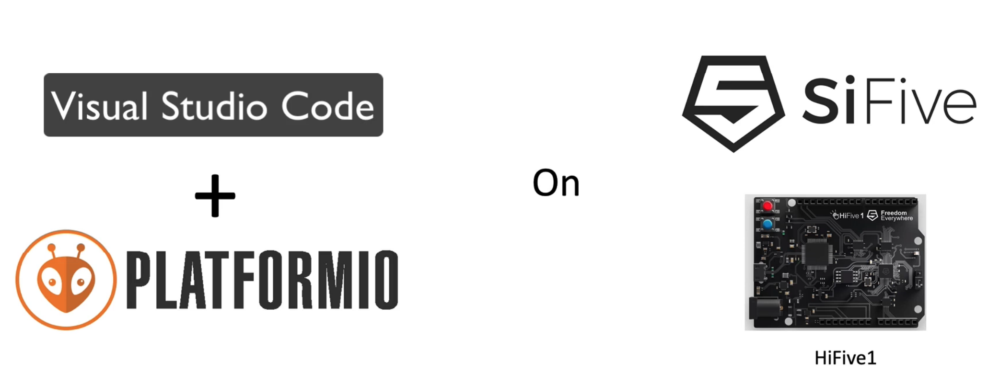

[HiFive1 - SiFive](https://www.sifive.com/boards/hifive1)

[SiFive-软件工具](https://www.sifive-china.com/site/Software_tools)

**[Hifive1(RISC-V)开发板在Arduino IDE中的配置方法_嵌入式_BlueStorm的博客-CSDN博客](https://blog.csdn.net/BlueStorm/article/details/80992320)**

**[HiFive1 RevB 开发板开发（一） 平台搭建及例程运行 （windows）_运维_fengyegbwz的博客-CSDN博客](https://blog.csdn.net/fengyegbwz/article/details/95029239?depth_1-utm_source=distribute.pc_relevant.none-task&utm_source=distribute.pc_relevant.none-task)**

