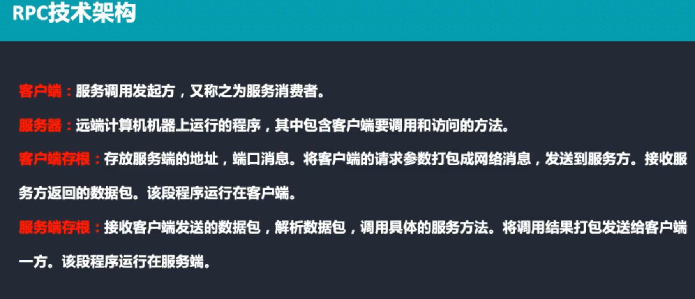
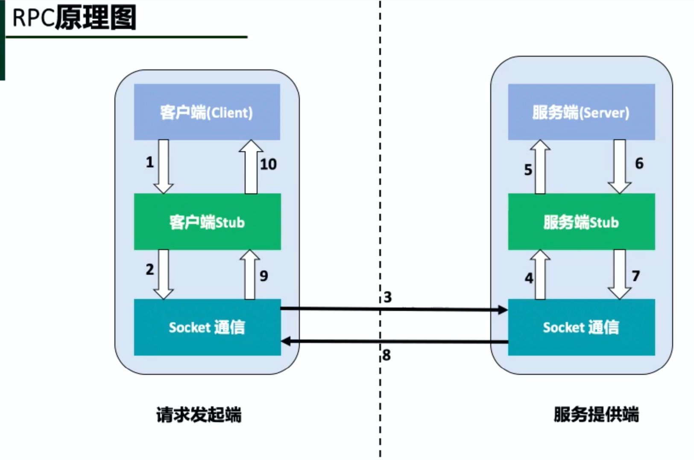
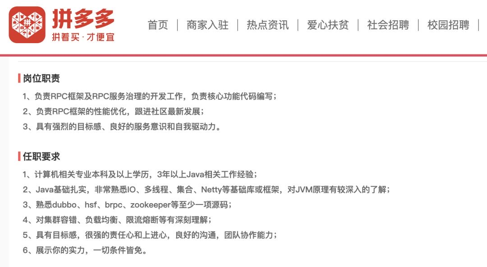

# Go语言学习笔记Day07

> 微服务
>
> Protobuf
>
> RPC

## 一、微服务

## 二、protobuf

## 三、RPC 简介以及原理

### 后端工程师，必须搞懂的 RPC 框架

去年我面试一位高级后端工程师的时候，看他简历上写着“熟练掌握 RPC 框架”，所以我就试探着问了他几个原理方面的问题，比如，**“大概说下 RPC 框架的核心原理”、“描述下序列化部分的逻辑”**。但聊了半天，我发现他其实并不熟，他的回答基本都是在告诉我怎么用，以及怎么更好地用好这些框架。

紧接着，我追问到，“如果没有 RPC 框架，那你要怎么调用另外一台服务器上的接口呢”。这问题可深可浅，但特别考验候选人的基本功，基本就能搞明白候选人是否深入思考过 RPC 框架的原理。

 

说到 RPC，我相信你只要在个稍微体量大的公司里待过就肯定会有接触。从技术复杂度上来，它一点都不简单。你去招聘网站上看看，**只要涉及到 PRC 框架开发的工作岗位，基本都在基础架构部门，并且薪水不低**。下面这张图是拼多多的 JD，薪水范围是 30K~60K。

**岗 位 职 责** 
	1 、 负 责 RPC 框 架 及 RPC 服 务 治 理 的 开 发 工 作 ， 负 责 核 心 功 能 代 码 编 写 ； 
	2 、 负 责 RPC 框 架 的 性 能 优 化 ， 跟 进 社 区 最 新 发 展 ；  
	3 、 具 有 强 烈 的 目 标 感 、 良 好 的 服 务 意 识 和 自 我 驱 动 力 。  
**任 职 要 求**  

​	1、 计 算 机 相 关 专 业 本 科 及 以 上 学 历 ， 3 年 以 上 Java 相 关 工 作 经 验 ；  
​	2 、 Java 基 础 扎 实 ， 非 常 熟 悉 ℃ 、 多 线 程 、 集 合 、 Netty 等 基 础 库 或 框 架 ， 对 JVM 原 理 有 较 深 入 的 了 解 ；  
3 、 熟悉 dubbo 、 hsf 、 brpc 、 zookeeper 等 至 少 一 项 源 码 ； 
4 、 对 集 群 容 错 、 负 载 均 衡 、 限 流 熔 断 等 有 深 刻 理 解 ；  
5 、 具 有 目 标 感 ， 很 强 的 责 任 心 和 上 进 心 ， 良 好 的 沟 通 ， 团 队 协 作 能 力 ；  
6 、 展 示 你 的 实 力 ， 一 切 条 件 皆 免 。 

为了帮你彻底搞懂 RPC，我在极客时间上开设了**《RPC实战与核心原理》**专栏。专栏里，我会结合过去 20 多年累积的工作经验，为你**精选出** **20 多个 RPC 相关的高频场景化问题，揉碎了帮你讲原理，帮你真正知其所以然。**

## 四、Go 语言 RPC 官方库编程实践

#### Server代码详情

#### Client代码详情

#### 多参数设置

#### 多参数-server代码详情

#### 多参数-client代码详情

## 五、RPC 和 Protobuf 结合

