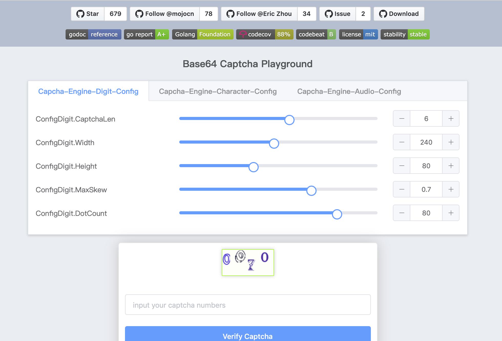

# 第014节：图形化验证码生成和验证


## 功能介绍

在使用用户名和密码登录功能时，需要填写验证码，验证码是以图形化的方式进行获取和展示的。

## 验证码使用原理

验证码的使用流程和原理为：在服务器端负责生成图形化验证码，并以数据流的形式供前端访问获取，同时将生成的验证码存储到全局的缓存中，在本案例中，我们使用redis作为全局缓存，并设置缓存失效时间。当用户使用用户名和密码进行登录时，进行验证码验证。验证通过即可继续进行登录。

## 验证码库安装

借助开源的验证码工具库可以生成验证码。
首先，安装开源的验证码生成库：

```go
go get -u github.com/mojocn/base64Captcha
```

## 验证码代码示例

在下载后的base64Captcha库的目录中，可以看到有_example和_example_redis两个目录。第一个example是用于演示生成验证码和验证码的示例代码。

按照示例代码的说明，运行程序并在浏览器进行端口访问：

```go
go run main.go
//浏览器中访问：http://localhost:8777
```

如下图所示：



通过自定义配置，可以选择不同的生成验证码的参数，并刷新验证码，同时还可以对验证码进行验证。

通过exmaple目录下的main.go程序可以看到生成验证码和验证验证码的逻辑，此处不再赘述。

## 项目集成验证码生成和Redis缓存

通常来说，验证码都是有一定的实效性的，过期验证码也就无效了。

因此，我们考虑在项目中引入Redis作为数据缓存。当验证码生成后，将验证码存放在Redis中，并根据配置文件对Redis进行设置。

### 安装go-redis库

在项目中使用redis,需要安装go-redis库，可以在https://github.com/go-redis/redis中查看如何下载go-redis和配置。

### 增加Redis配置

在配置文件app.json中新增redis配置：

```go
...
"redis_config": {
    "addr": "127.0.0.1",
    "port": "6379",
    "password": "",
    "db": 0
}
...
```

同时，新增RedisConfig结构体定义，如下所示：

```go
type RedisConfig struct {
    Addr string json:"addr"
    Port string json:"port"
    Db   int    json:"db"
}
```

### Redis初始化操作

进行了redis配置以后，需要对redis进行初始化。可以封装redis初始化操作函数如下所示：

```go
type RedisStore struct {
    redisClient *redis.Client
}

var Redis *redis.Client

func InitRediStore() *RedisStore {
    config := GetConfig().RedistConfig

    Redis = redis.NewClient(&redis.Options{
        Addr:     config.Addr + ":" + config.Port,
        Password: "",
        DB:       config.Db,
    })

    customeStore := &RedisStore{Redis}
    base64Captcha.SetCustomStore(customeStore)

    return customeStore
}

```

同时，为customeStore提供Set和Get两个方法，如下所示：

```go
func (cs *RedisStore) Set(id string, value string) {
    err := cs.redisClient.Set(id, value, time.Minute*10).Err()
    if err != nil {
        log.Println(err.Error())
    }
}

func (cs *RedisStore) Get(id string, clear bool) string {
    val, err := cs.redisClient.Get(id).Result()
    if err != nil {
        toolbox.Error(err.Error())
        return ""
    }
    if clear {
        err := cs.redisClient.Del(id).Err()
        if err != nil {
            toolbox.Error(err.Error())
            return ""
        }
    }
    return val
}
```

对Redis进行初始化和定义完成以后，需要在main中调用一下初始化操作InitRediStore:

```go
func main(){
    ...
    //Redis配置初始化
     toolbox.InitRediStore()
    ...
}
```

### 验证码生成和验证

本项目中采用的验证码的生成库支持三种验证码，分别是：audio，character和digit。我们选择character类型。

定义Captcha.go文件，实现验证码的生成和验证码函数的定义。在进行验证码生成时，默认提供验证码的配置，并生成验证码后返回给客户端浏览器。如下是生成验证码的函数定义：

```go
//生成验证码
func GenerateCaptchaHandler(w http.ResponseWriter, r *http.Request) {

    // parse request parameters
    // 接收客户端发送来的请求参数

    postParameters := ConfigJsonBody{
        CaptchaType: "character",
        ConfigCharacter: base64Captcha.ConfigCharacter{
            Height:             60,
            Width:              240,
            Mode:               3,
            ComplexOfNoiseText: 0,
            ComplexOfNoiseDot:  0,
            IsUseSimpleFont:    true,
            IsShowHollowLine:   false,
            IsShowNoiseDot:     false,
            IsShowNoiseText:    false,
            IsShowSlimeLine:    false,
            IsShowSineLine:     false,
            CaptchaLen:         6,
            BgColor: &color.RGBA{
                R: 3,
                G: 102,
                B: 214,
                A: 254,
            },
        },
    }
    // 创建base64图像验证码

    var config interface{}
    switch postParameters.CaptchaType {
    case "audio":
        config = postParameters.ConfigAudio
    case "character":
        config = postParameters.ConfigCharacter
    default:
        config = postParameters.ConfigDigit
    }
    captchaId, captcaInterfaceInstance := base64Captcha.GenerateCaptcha(postParameters.Id, config)
    base64blob := base64Captcha.CaptchaWriteToBase64Encoding(captcaInterfaceInstance)

    // 设置json响应
    w.Header().Set("Content-Type", "application/json; charset=utf-8")
    body := map[string]interface{}{"code": 1, "data": base64blob, "captchaId": captchaId, "msg": "success"}
    json.NewEncoder(w).Encode(body)
}
```

### 验证码接口解析

图形化验证码是用户名和密码登录功能的数据，属于Member模块。因此在MemberController中增加获取验证码的接口解析，如下：

```go
func (mc *MemberController) Router(engine *gin.Engine){
    //获取验证码
    engine.GET("/api/captcha", mc.captcha)
}
```

测试结果如下，能够正常获取到数据：


### 验证码的验证

同理，可以对客户端提交的验证码进行验证，具体实现逻辑如下:

```go
func CaptchaVerify(r *http.Request) bool {
    //parse request parameters
    //接收客户端发送来的请求参数
    decoder := json.NewDecoder(r.Body)
    var postParameters ConfigJsonBody
    err := decoder.Decode(&postParameters)
    if err != nil {
        log.Println(err)
    }

    defer r.Body.Close()

    //比较图像验证码
    verifyResult := base64Captcha.VerifyCaptcha(postParameters.Id, postParameters.VerifyValue)
    return verifyResult
}
```

